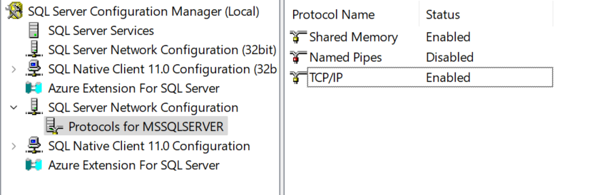
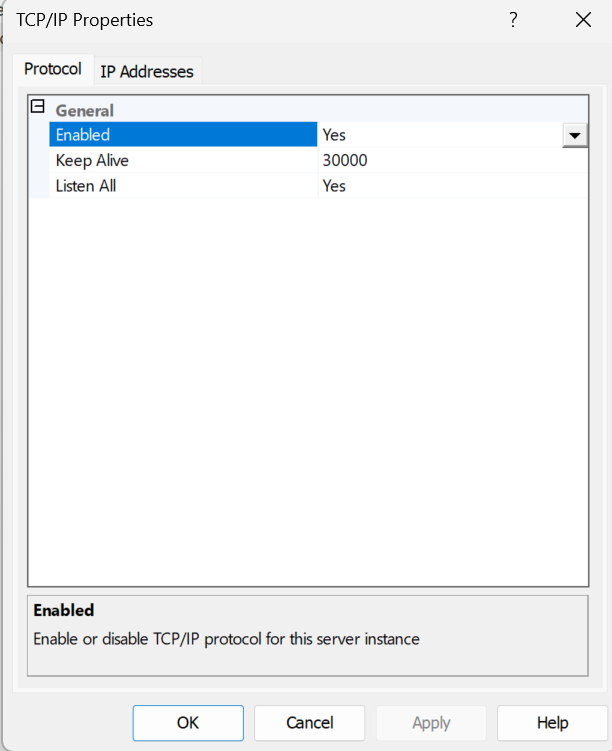
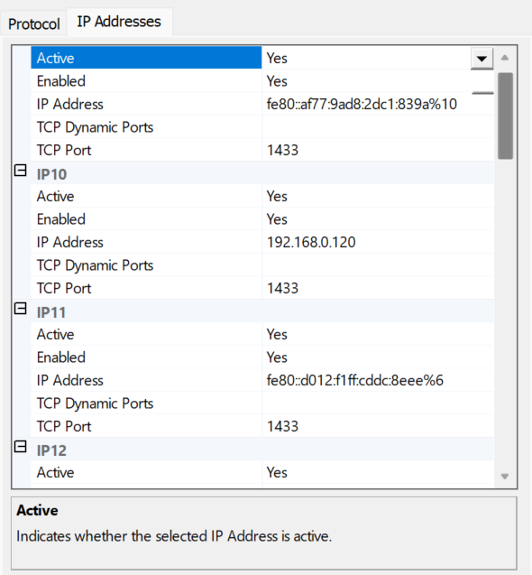
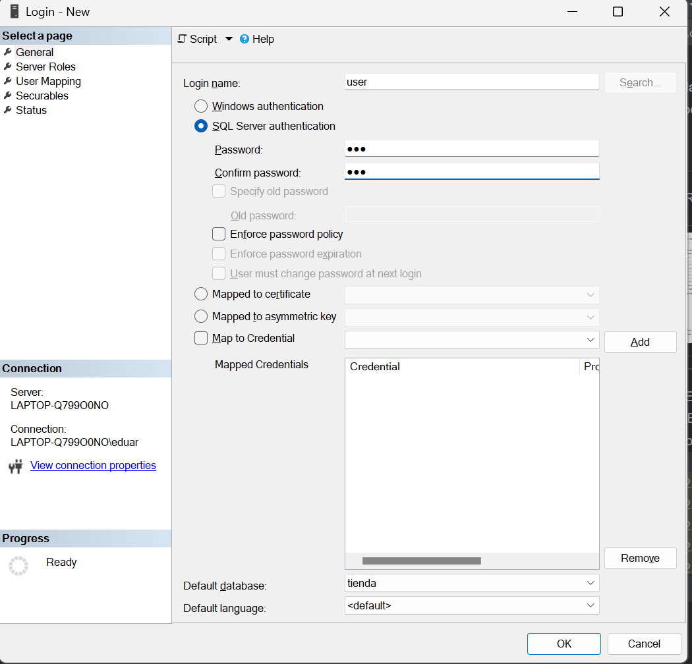
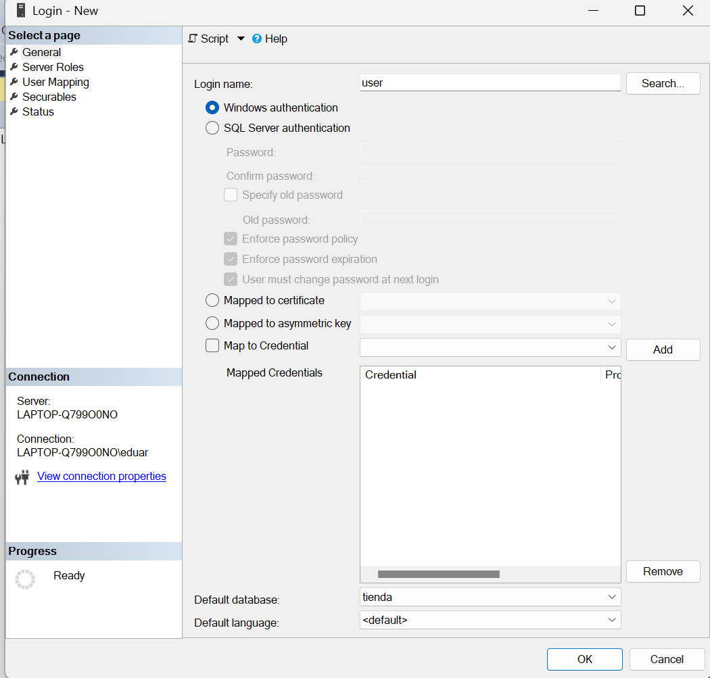
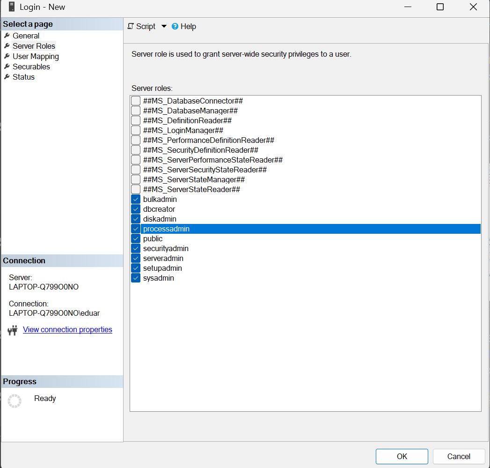
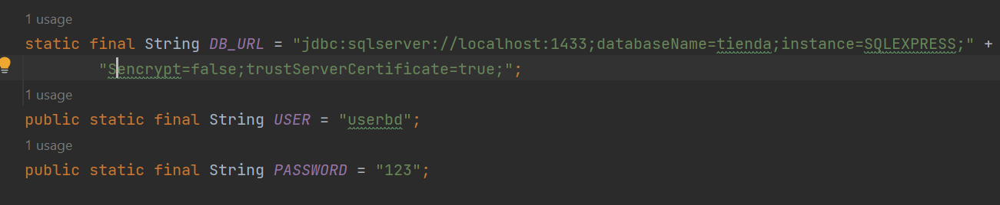

# JavaAppTienda

Realizado por: Eduardo Almachi

Aplicacion creada con Java con y conectada a SQL SERVER

La aplicacion realiza un CRUD con productos y proveedores.

---
## Pasos para conexion y creacion de aplicacion CRUD JAVA

 - Configuracion SQL SERVER
   - Debemos habilitar el puerto de conexion, realizado esto se habilitara la conexion.

  |                                  |  |                                              |
  |---------------------------------------------------------|-------------------------|---------------------------------------------------------------------|
  | Entramos SQL SERVER CONFIGURATION y vamos a esta opcion | Habilitamos todo en yes | Nuevamente aqui habilatamos todo si y que los puertos esten en 1433 |
  

  - Configuracion SQL SERVER MANAGEMENT

  |                                                                   |                 |                  |
  |------------------------------------------------------------------------------------------|----------------------------------------|-----------------------------------------|
  | Creamos un usuario para la conexion y seleccionamos la base con la que queremos trabajar | Configuramos al usuario de esta manera | Damos los permisos necesarios señalados |

- Conexion JAVA SQL SERVER
  - Para conectar a SQL SERVER debemos descargar el driver e instalarlo en nuestro proyecto.
  
  
  - Realizado esto debemos configurar las variables en el proyecto.
    - Especificamos puertos y usuarios como contraseña creados previamente.
  

  