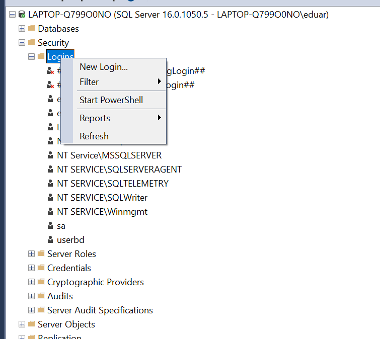

# JavaAppTienda

Realizado por: Eduardo Almachi

Aplicacion credad con Java y conectada a SQL SERVER

---
 Configuracion SQL SERVER
  - Debemos habilitar el puerto de conexion, realizado esto se habilitara la conexion.

  |                                  |  |                                              |
  |---------------------------------------------------------|-------------------------|---------------------------------------------------------------------|
  | Entramos SQL SERVER CONFIGURATION y vamos a esta opcion | Habilitamos todo en yes | Nuevamente aqui habilatamos todo si y que los puertos esten en 1433 |
  
  
  

- Conexion JAVA SQL SERVER
  - Para conectar a SQL SERVER debemos descargar el driver e instalarlo en nuestro proyecto.
  
  
  - Realizado esto debemos configurar las variables en el proyecto.
    - Especificamos puertos y usuarios como contraseña creados previamente.
  
  