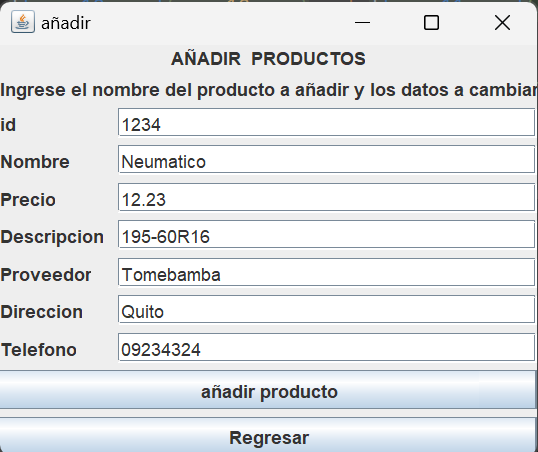

# JavaAppTienda

Realizado por: Eduardo Almachi

Aplicacion creada con Java con y conectada a SQL SERVER

La aplicacion realiza un CRUD con productos y proveedores.

---
## Pasos para conexion y creacion de aplicacion CRUD JAVA

 - Configuracion SQL SERVER
   - Debemos habilitar el puerto de conexion, realizado esto se habilitara la conexion.

  |                                  |  |                                              |
  |---------------------------------------------------------|-------------------------|---------------------------------------------------------------------|
  | Entramos SQL SERVER CONFIGURATION y vamos a esta opcion | Habilitamos todo en yes | Nuevamente aqui habilatamos todo si y que los puertos esten en 1433 |
  

  - Configuracion SQL SERVER MANAGEMENT

  |                                                                   |                 |                  |
  |------------------------------------------------------------------------------------------|----------------------------------------|-----------------------------------------|
  | Creamos un usuario para la conexion y seleccionamos la base con la que queremos trabajar | Configuramos al usuario de esta manera | Damos los permisos necesarios señalados |

- Conexion JAVA SQL SERVER
  - Para conectar a SQL SERVER debemos descargar el driver e instalarlo en nuestro proyecto.
  
  
  - Realizado esto debemos configurar las variables en el proyecto.
    - Especificamos puertos y usuarios como contraseña creados previamente.
  
  
- Aplicacion
  - Seccion Principal
  
  - Ver producto
  
  |             |
  |------------------------------------|
  | Si se ingresa el id se lee el dato |

  - Eliminar producto
  
  |    |                              |
  |-----------------------------|-------------------------------------------------------|
  | Se elimina por medio del id | Se elimina el producto y el proveedor al mismo tiempo |

  - Actualizar producto
  
  |                                                |       |         |
  |-------------------------------------------------------------------------|--------------------------------|----------------------------------|
  | Se actualiza por medio del id y se procede a hacer el respectivo cambio | Se realizo el cambio con exito | Se actualiza en la base de datos |                         |

  - Añadir producto
  
  |             |  |      |
  |--------------------------------------|---------------------------|-------------------------------|
  | Se añade los campos para el producto | Se confirma el producto   | Se muestra el cambio en la BD |

  